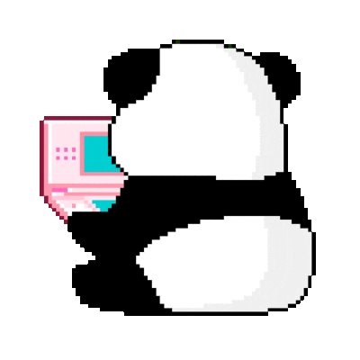

Olá! Meu nome é :sparkles:Andressa:sparkles:

Eu sou uma Software Engineer autodidata e trabalho como Software Quality Engineer na Red Hat! Eu acredito que *conhecimento deve ser compartilhado e de livre acesso para todas as pessoas*! Eu amo aprender coisas novas e esse é um dos porquês eu amo tanto programar!  

Minha linguagem de programação preferida é Python e eu trabalho diariamente com Golang e Ruby!  

Ainda, eu gosto de escrever coisas para a [DEV community](https://dev.to/andressadotpy) :computer: e se você quiser pode me seguir no Twitter [@andressadotpy](https://twitter.com/andressadotpy)!

--  

Hello! My name is :sparkles:Andressa:sparkles:  
  
I'm a self-taught Software Engineer and I work as Software Quality Engineer at Red Hat. I believe *knowledge must be shared and accessible to everyone*! I love learning new things and this is one of the reasons why I love coding so much!  
  
My favorite programming language is Python and I work daily with Golang and Ruby!
  
Also, I like writing blog posts in my profile in the [DEV community](https://dev.to/andressadotpy) :computer: and if you like, follow me at Twitter [@andressadotpy](https://twitter.com/andressadotpy)!
